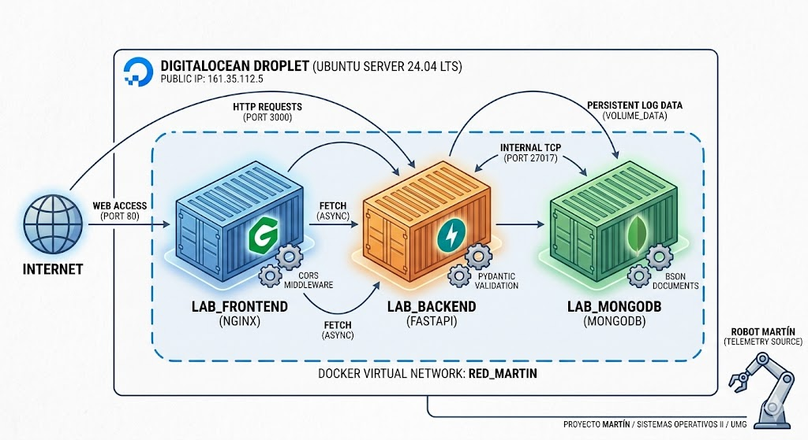

# Proyecto Final — Proyecto MARTÍN

[](#-diseño-de-la-arquitectura-del-sistema)
[](#-información-de-despliegue-producción)
[](#-tecnologías-y-ecosistema-tecnológico)

Este repositorio alberga el código fuente, las configuraciones de entorno y el protocolo de infraestructura correspondientes al **Proyecto Final de Sistemas Operativos II**. La solución implementa un ecosistema distribuido y desacoplado en la nube que actúa como el nodo receptor, validador y persistente de las métricas de telemetría y logs generados de forma asíncrona por el prototipo robótico de laboratorio (**MARTÍN**).

---

## 🌐 Información de Despliegue (Producción)

La infraestructura se encuentra completamente aprovisionada y operativa en producción. Con base en los requerimientos formales de la cátedra, el acceso se realiza de forma directa mediante direccionamiento IP nativo sin capas de enmascaramiento DNS:

* **Capa de Presentación (Dashboard Web):** `http://161.35.112.5`
* **Capa de Lógica de Negocio (REST API Entrypoint):** `http://161.35.112.5:3000`

---

## 📐 Diseño de la Arquitectura del Sistema

El sistema rompe con la rigidez de los esquemas monolíticos tradicionales al implementar una **Arquitectura Orientada a Microservicios (SOA)**. El flujo está segmentado en tres capas aisladas, independientes e indivisibles interconectadas mediante una topología de red virtualizada.



### Mecanismos de Aislamiento y Resiliencia en Redes
1. **Red Aislada de Tipo Bridge (`red_martin`):** Se implementó un conmutador virtual privado dentro del demonio de Docker. Este canal deniega de forma estricta cualquier exposición o mapeo público del puerto de la base de datos (`27017`) hacia Internet. La API (`lab_backend`) se comunica de forma exclusiva con el motor de persistencia mediante un **DNS interno por resolución de nombre de contenedor** (`mongodb://lab_mongodb:27017`), blindando el almacenamiento de datos contra vectores de ataque externos.
2. **Políticas de Autogestión de Procesos:** Todos los contenedores han sido inyectados con la directiva operativa `--restart unless-stopped`. Esto transfiere la responsabilidad de la orquestación de disponibilidad al motor nativo de Docker, obligando al host a levantar de forma automática el backend, el frontend y la base de datos inmediatamente tras un reinicio del sistema operativo, garantizando una alta tolerancia a fallos.

---

## 🛠️ Tecnologías y Ecosistema Tecnológico

### Infraestructura y Virtualización OS-Level
* **Cloud Hosting Provider:** DigitalOcean (Virtual Private Server - Droplet Aprovisionado).
* **Distribución Host Linux:** Ubuntu Server 24.04.4 LTS (Noble Numbat).
* **Núcleo del Sistema:** Linux Kernel 6.8.0-31-generic x86_64 architecture.
* **Motor de Contenedores:** Docker Engine Runtime Environment (Nativo).

### Stack de Componentes de Software
* **Frontend:** Nginx Server (Alpine-lightweight base image), encargado del renderizado estático de la interfaz del Dashboard mediante HTML5 semántico, CSS3 estructurado bajo patrones responsivos y JavaScript asíncrono puro (Fetch API).
* **Backend:** Python 3.10 + FastAPI Framework. Procesa la lógica transaccional, ejecuta la validación sintáctica de esquemas dinámicos JSON a través de modelos Pydantic y gestiona las políticas permisivas del middleware de Origen Cruzado (CORS).
* **Base de Datos:** MongoDB NoSQL Engine. Manejo flexible de colecciones orientadas a documentos BSON, vinculada a un volumen persistente mapeado directamente en el disco duro del Host (`proyecto_martin_mongo_data`).

---

## 🚀 Guía de Operación y Runbook de Infraestructura

### 1. Acceso de Administración Remota (Secured Shell)
Para auditorías de código o inspección en vivo de la terminal por parte del equipo técnico:
```bash
ssh martin@161.35.112.5
2. Despliegue de la Topología desde Cero (Cold Start)En caso de requerir la reconstrucción total de las capas del sistema dentro del servidor, ejecute la siguiente secuencia secuencial de comandos:Bash# Inicializar el canal de comunicación privado
sudo docker network create red_martin 2>/dev/null

# Instanciar Capa de Persistencia con almacenamiento persistente
sudo docker run -d --name lab_mongodb --network red_martin -v proyecto_martin_mongo_data:/data/db mongo:latest

# Instanciar Capa Lógica (API REST) enlazada al entorno
sudo docker run -d --name lab_backend --network red_martin -p 3000:3000 -e MONGO_URI=mongodb://lab_mongodb:27017/logs_robotica martin_backend

# Instanciar Capa de Presentación (Servidor Web Nginx)
sudo docker run -d --name lab_frontend --network red_martin -p 80:80 martin_frontend
3. Diagnóstico y Monitoreo de Recursos en Tiempo RealHerramientas críticas para la validación del comportamiento de la infraestructura durante la defensa presencial:Bash# Validar sockets de escucha, IDs de proceso y mapeo de puertos activos
sudo docker ps

# Monitorear consumo porcentual de CPU, Memoria RAM y rendimiento de Red I/O
sudo docker stats

# Inspección y flujo continuo de la salida estándar (Logs de depuración del Backend)
sudo docker logs -f lab_backend
4. Control del Ciclo de Vida del EcosistemaBash# Interrupción controlada de la ejecución de los servicios (Graceful Shutdown)
sudo docker stop lab_frontend lab_backend lab_mongodb

# Inicialización en caliente de contenedores persistidos en el sistema
sudo docker start lab_mongodb lab_backend lab_frontend

# Forzar reinicio de hilos de ejecución en la API de FastAPI
sudo docker restart lab_backend
📊 Matriz de Simulación de Escenarios de Tolerancia a Fallos (Rúbrica)Durante la demostración técnica ante el docente evaluador, la estabilidad de los microservicios y el desacoplamiento se corroborarán mediante la ejecución del siguiente protocolo de contingencia:Escenario de ValidaciónEjecución en ConsolaComportamiento Técnico EsperadoAislamiento Absoluto del Backendsudo docker stop lab_backendEl microservicio lab_frontend (Nginx - Puerto 80) permanece en línea sirviendo los componentes web estáticos. No obstante, la interfaz detecta la pérdida del socket y despliega de forma reactiva un banner de alerta controlado: "⚠️ Error al conectar con el Backend de Logs". No se registran nuevos eventos en el sistema.Falla Crítica en Capa de Datos (Persistencia)sudo docker stop lab_mongodbEl backend (FastAPI - Puerto 3000) continúa receptivo ante las tramas JSON transmitidas por el robot. Al intentar procesar la transacción, los bloques de control try/except interceptan la falta de comunicación con la base de datos y devuelven al cliente una respuesta estructurada con código de Estado HTTP 500 (Internal Server Error), evitando el colapso del servicio de red.Caída Total del Sistema de Presentaciónsudo docker stop lab_frontendEl acceso web al Dashboard a través del puerto HTTP estándar queda fuera de servicio (Generando un error de Timeout en navegadores). Sin embargo, la lógica de adquisición (Puerto 3000) y MongoDB siguen funcionando en segundo plano de manera ininterrumpida. Los flujos de telemetría entrantes procesan y guardan los logs con éxito retornando un código de Estado HTTP 200 (OK).Normalización y Sincronía del Entornosudo docker start [contenedor]El contenedor afectado recobra instantáneamente su ejecución y se acopla de forma transparente a la red red_martin. El Dashboard web restablece el flujo asíncrono y actualiza las tablas cronológicas automáticamente sin requerir reinicios globales del servidor.
